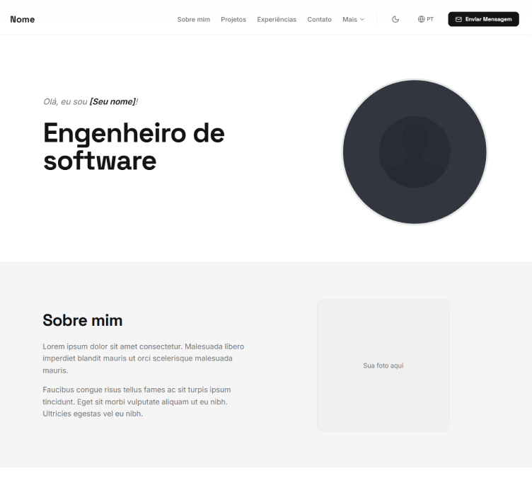
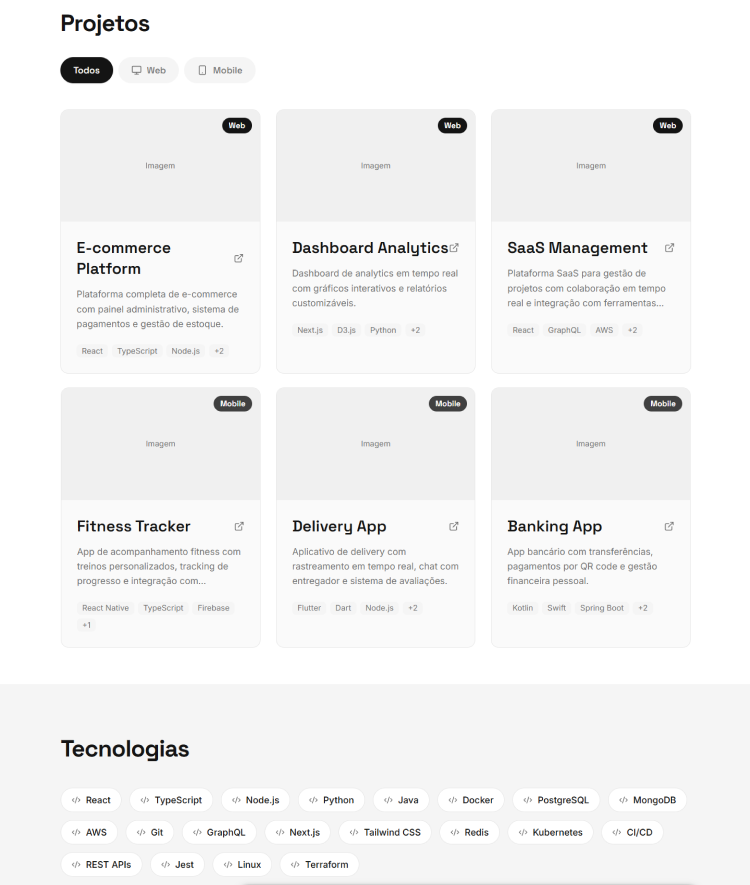
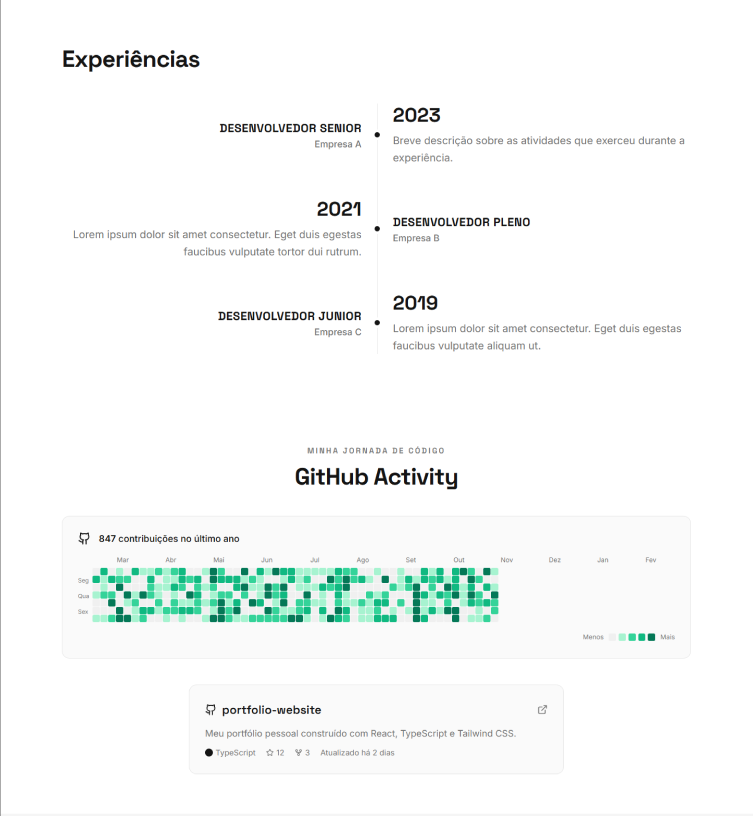
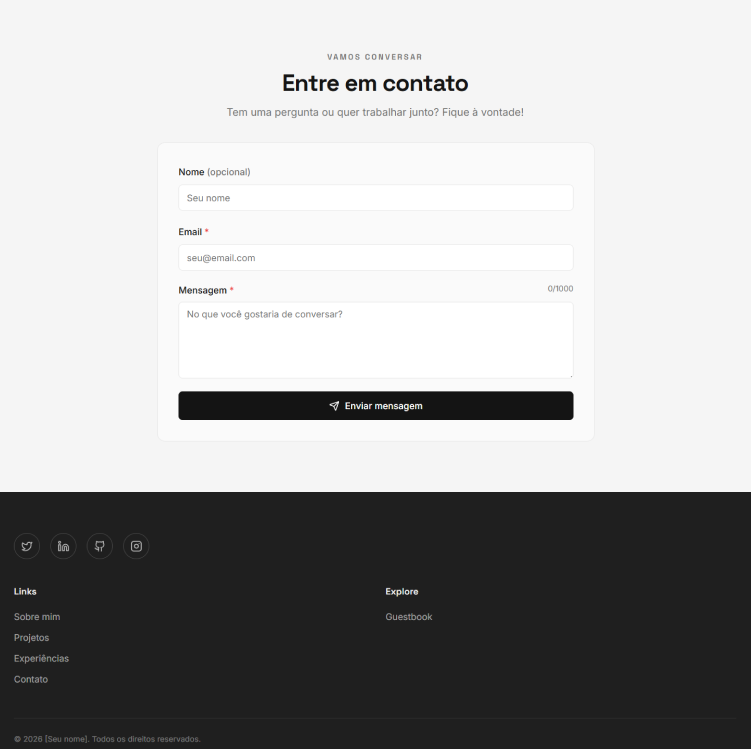
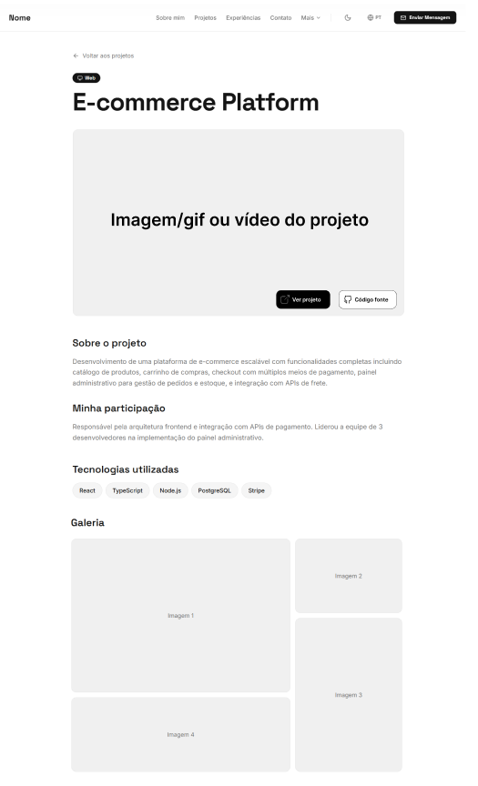
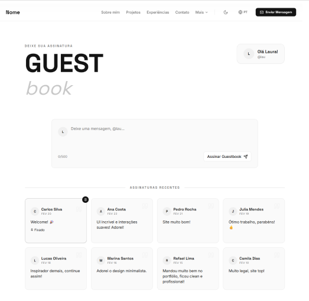

# 🚀 Portfólio Profissional - LAB01

> **Disciplina:** Laboratório de Desenvolvimento de Software  
> **Curso:** Engenharia de Software  
> **Professor:** João Paulo Carneiro Aramuni

---

## 🚧 Status do Projeto

[](https://github.com/Eric-Leal/portfolio/releases)


---

## 📚 Índice

- [Sobre o Projeto](#-sobre-o-projeto)
- [Tecnologias Utilizadas](#%EF%B8%8F-tecnologias-utilizadas)
- [Estrutura do Projeto](#-estrutura-do-projeto)
- [Design System](#-design-system)
- [Protótipos e Wireframes](#%EF%B8%8F-protótipos-e-wireframes)
- [Instalação e Execução](#-instalação-e-execução)
- [Deploy](#-deploy)
- [Roadmap de Desenvolvimento](#-roadmap-de-desenvolvimento)
- [Equipe](#-equipe)
- [Licença](#-licença)
- [Agradecimentos](#-agradecimentos)

---

## 📋 Sobre o Projeto

Este projeto consiste no desenvolvimento de um website de portfólio profissional moderno e responsivo, criado como parte do Laboratório 01 da disciplina de Desenvolvimento de Software. O objetivo é apresentar trajetória, habilidades, projetos e formas de contato de maneira profissional e acessível.

### Objetivos do Sistema

O portfólio será composto por quatro seções principais, acessíveis através de um menu de navegação intuitivo:

1. **Sobre Mim** - Apresentação pessoal em português e inglês, destacando formação, área de atuação e objetivos profissionais
2. **Projetos** - Linha do tempo com projetos desenvolvidos, incluindo descrição, tecnologias e links para repositórios
3. **Experiências** - Histórico profissional, estágios, freelas e participações em projetos open source
4. **Contato** - Formulário de contato com envio de e-mail e links para redes sociais

---

## 🛠️ Tecnologias Utilizadas

### Core

- **[Next.js 16](https://nextjs.org/)** - Framework React para produção com App Router
- **[TypeScript 5](https://www.typescriptlang.org/)** - Superset tipado do JavaScript
- **[React 19](https://react.dev/)** - Biblioteca para construção de interfaces

### Estilização e UI

- **[TailwindCSS 4](https://tailwindcss.com/)** - Framework CSS utility-first
- **[Shadcn UI](https://ui.shadcn.com/)** - Componentes reutilizáveis e acessíveis
- **[Magic UI](https://magicui.design/)** - Componentes animados e interativos _(Planejado)_
- **[Radix UI](https://www.radix-ui.com/)** - Primitivos de UI headless e acessíveis
- **[Lucide React](https://lucide.dev/)** - Ícones SVG modernos
- **[Class Variance Authority](https://cva.style/docs)** - Gerenciamento de variantes de componentes

### Animações

- **[Framer Motion](https://www.framer.com/motion/)** - Biblioteca de animações para React _(Planejado)_
- **[GSAP](https://gsap.com/)** - Biblioteca profissional de animações JavaScript _(Planejado)_
- **[tw-animate-css](https://www.npmjs.com/package/tw-animate-css)** - Animações CSS com Tailwind

### Gerenciamento de Estado

- **[Zustand](https://zustand.docs.pmnd.rs/)** - Gerenciamento de estado minimalista _(Planejado)_

### Backend e Dados

- **[Supabase](https://supabase.com/)** - Backend como serviço (BaaS) com PostgreSQL _(Planejado)_
- **[Zod](https://zod.dev/)** - Validação de schemas TypeScript-first _(Planejado)_

### Qualidade de Código

- **[ESLint 9](https://eslint.org/)** - Linter para identificar problemas no código
- **[Prettier 3](https://prettier.io/)** - Formatador de código
- **[Husky 9](https://typicode.github.io/husky/)** - Git hooks para automação
- **[lint-staged](https://github.com/okonet/lint-staged)** - Executa linters em arquivos staged

### Hospedagem

- **[Vercel](https://vercel.com/)** - Plataforma de deploy e hospedagem

---

## 📁 Estrutura do Projeto

```
portfolio/
├── public/                      # Arquivos públicos estáticos
│
├── src/
│   └── app/                    # App Router do Next.js
│   
│   │   ├── globals.css         # Estilos globais e variáveis CSS
│   │   ├── layout.tsx          # Layout principal da aplicação
│   │   └── page.tsx            # Página inicial (home)
│   ├── components/             # Componentes React reutilizáveis
│   │   ├── ui/                 # Componentes de interface
│   │   │   └── animated-theme-toggler.tsx
│   │   └── theme-provider.tsx  # Provider de temas
│   └── lib/
│       └── utils.ts            # Funções utilitárias
├── .eslintrc.json             # Configuração do ESLint
├── components.json            # Configuração do Shadcn UI
├── eslint.config.mjs          # Configuração adicional do ESLint
├── next.config.ts             # Configuração do Next.js
├── package.json               # Dependências e scripts
├── postcss.config.mjs         # Configuração do PostCSS
├── tsconfig.json              # Configuração do TypeScript
└── README.md                  # Documentação principal
```

---

## 🎨 Design System

O projeto utiliza um design system customizado com suporte a **tema claro e escuro**, implementando:

- **Paleta de Cores Dinâmica:** Tokens CSS personalizados para cores de brand, accent e sistema
- **Tipografia:** Combinação de Outfit (sans-serif) e Cormorant Infant (serif itálico)
- **Componentes Reutilizáveis:** Biblioteca baseada em Shadcn UI com customizações
- **Responsividade:** Mobile-first com breakpoints otimizados
- **Acessibilidade:** Componentes seguem padrões WCAG

### Funcionalidades Implementadas (Sprint 1)

✅ **Layout Principal**

- Header com navegação responsiva
- Footer com informações de copyright
- Sistema de grid responsivo

✅ **Theme Switcher**

- Toggle animado entre tema claro e escuro
- Persistência de preferência do usuário
- Suporte a preferência do sistema

✅ **Página Inicial**

- Hero section com apresentação
- Call-to-actions destacados
- Indicador de disponibilidade para projetos

✅ **Navegação**

- Estrutura de páginas definida
- Sistema de roteamento do Next.js configurado
- Links entre seções implementados

---

## 🖼️ Protótipos e Wireframes

### Wireframes de Média Fidelidade

#### Homepage (Página Principal)

A homepage é uma página única com scroll contendo todas as seções principais:

**Hero Section + Sobre Mim:**



**Seção de Projetos:**



**Seção de Experiências:**



**Seção de Contato:**



**Página de Detalhes do Projeto:**



**Página Guestbook:**



---

## 🚀 Instalação e Execução

### Pré-requisitos

- **Node.js** 20.x ou superior
- **npm**, **yarn**, **pnpm** ou **bun**
- Git

### Passos para Instalação

1. **Clone o repositório:**

   ```bash
   git clone https://github.com//portfolio.git
   cd portfolio
   ```

2. **Instale as dependências:**

   ```bash
   npm install
   # ou
   yarn install
   # ou
   pnpm install
   # ou
   bun install
   ```

3. **Configure as variáveis de ambiente:**

   ```bash
   cp .env.example .env.local
   ```

   Preencha as variáveis necessárias:

   ```env
   NEXT_PUBLIC_SUPABASE_URL=sua-url-supabase
   NEXT_PUBLIC_SUPABASE_ANON_KEY=sua-key-supabase
   ```

4. **Execute o servidor de desenvolvimento:**

# 🚀 Portfólio Profissional - LAB01

> **Disciplina:** Laboratório de Desenvolvimento de Software  
> **Curso:** Engenharia de Software  
> **Professor:** João Paulo Carneiro Aramuni

---

## 🚧 Status do Projeto

[](https://github.com/Eric-Leal/portfolio/releases)


---

## 📚 Índice

- [Sobre o Projeto](#-sobre-o-projeto)
- [Tecnologias Utilizadas](#%EF%B8%8F-tecnologias-utilizadas)
- [Estrutura do Projeto](#-estrutura-do-projeto)
- [Design System](#-design-system)
- [Protótipos e Wireframes](#%EF%B8%8F-protótipos-e-wireframes)
- [Instalação e Execução](#-instalação-e-execução)
- [Deploy](#-deploy)
- [Roadmap de Desenvolvimento](#-roadmap-de-desenvolvimento)
- [Equipe](#-equipe)
- [Licença](#-licença)
- [Agradecimentos](#-agradecimentos)

---

## 📋 Sobre o Projeto

Este projeto consiste no desenvolvimento de um website de portfólio profissional moderno e responsivo, criado como parte do Laboratório 01 da disciplina de Desenvolvimento de Software. O objetivo é apresentar trajetória, habilidades, projetos e formas de contato de maneira profissional e acessível.

### Objetivos do Sistema

O portfólio será composto por quatro seções principais, acessíveis através de um menu de navegação intuitivo:

1. **Sobre Mim** - Apresentação pessoal em português e inglês, destacando formação, área de atuação e objetivos profissionais
2. **Projetos** - Linha do tempo com projetos desenvolvidos, incluindo descrição, tecnologias e links para repositórios
3. **Experiências** - Histórico profissional, estágios, freelas e participações em projetos open source
4. **Contato** - Formulário de contato com envio de e-mail e links para redes sociais

---

## 🛠️ Tecnologias Utilizadas

### Core

- **[Next.js 16](https://nextjs.org/)** - Framework React para produção com App Router
- **[TypeScript 5](https://www.typescriptlang.org/)** - Superset tipado do JavaScript
- **[React 19](https://react.dev/)** - Biblioteca para construção de interfaces

### Estilização e UI

- **[TailwindCSS 4](https://tailwindcss.com/)** - Framework CSS utility-first
- **[Shadcn UI](https://ui.shadcn.com/)** - Componentes reutilizáveis e acessíveis
- **[Magic UI](https://magicui.design/)** - Componentes animados e interativos _(Planejado)_
- **[Radix UI](https://www.radix-ui.com/)** - Primitivos de UI headless e acessíveis
- **[Lucide React](https://lucide.dev/)** - Ícones SVG modernos
- **[Class Variance Authority](https://cva.style/docs)** - Gerenciamento de variantes de componentes

### Animações

- **[Framer Motion](https://www.framer.com/motion/)** - Biblioteca de animações para React _(Planejado)_
- **[GSAP](https://gsap.com/)** - Biblioteca profissional de animações JavaScript _(Planejado)_
- **[tw-animate-css](https://www.npmjs.com/package/tw-animate-css)** - Animações CSS com Tailwind

### Gerenciamento de Estado

- **[Zustand](https://zustand.docs.pmnd.rs/)** - Gerenciamento de estado minimalista _(Planejado)_

### Backend e Dados

- **[Supabase](https://supabase.com/)** - Backend como serviço (BaaS) com PostgreSQL _(Planejado)_
- **[Zod](https://zod.dev/)** - Validação de schemas TypeScript-first _(Planejado)_

### Qualidade de Código

- **[ESLint 9](https://eslint.org/)** - Linter para identificar problemas no código
- **[Prettier 3](https://prettier.io/)** - Formatador de código
- **[Husky 9](https://typicode.github.io/husky/)** - Git hooks para automação
- **[lint-staged](https://github.com/okonet/lint-staged)** - Executa linters em arquivos staged

### Hospedagem

- **[Vercel](https://vercel.com/)** - Plataforma de deploy e hospedagem

---

## 📁 Estrutura do Projeto

```
portfolio/
├── public/                      # Arquivos públicos estáticos
├── docs/                        # Documentação e wireframes
│   └── wireframes/              # Imagens dos protótipos do Figma
│       ├── Home&Sobre.png
│       ├── Projetos&Tecnologias.png
│       ├── Experiencias.png
│       ├── Contato.png
│       ├── DetalhesProjeto.png
│       └── Guestbook.png
├── src/
│   ├── app/                    # App Router do Next.js
│   │   ├── design-system/
│   │   │   └── page.tsx
│   │   ├── globals.css         # Estilos globais e variáveis CSS
│   │   ├── layout.tsx          # Layout principal da aplicação
│   │   └── page.tsx            # Página inicial (home)
│   ├── components/             # Componentes React reutilizáveis
│   │   ├── ui/                 # Componentes de interface
│   │   │   └── animated-theme-toggler.tsx
│   │   └── theme-provider.tsx  # Provider de temas
│   └── lib/
│       └── utils.ts            # Funções utilitárias
├── .eslintrc.json             # Configuração do ESLint
├── components.json            # Configuração do Shadcn UI
├── eslint.config.mjs          # Configuração adicional do ESLint
├── next.config.ts             # Configuração do Next.js
├── package.json               # Dependências e scripts
├── postcss.config.mjs         # Configuração do PostCSS
├── tsconfig.json              # Configuração do TypeScript
└── README.md                  # Documentação principal
```

---

## 🎨 Design System

O projeto utiliza um design system customizado com suporte a **tema claro e escuro**, implementando:

- **Paleta de Cores Dinâmica:** Tokens CSS personalizados para cores de brand, accent e sistema
- **Tipografia:** Combinação de Outfit (sans-serif) e Cormorant Infant (serif itálico)
- **Componentes Reutilizáveis:** Biblioteca baseada em Shadcn UI com customizações
- **Responsividade:** Mobile-first com breakpoints otimizados
- **Acessibilidade:** Componentes seguem padrões WCAG

### Funcionalidades Implementadas (Sprint 1)

✅ **Layout Principal**

- Header com navegação responsiva
- Footer com informações de copyright
- Sistema de grid responsivo

✅ **Theme Switcher**

- Toggle animado entre tema claro e escuro
- Persistência de preferência do usuário
- Suporte a preferência do sistema

✅ **Página Inicial**

- Hero section com apresentação
- Call-to-actions destacados
- Indicador de disponibilidade para projetos

✅ **Navegação**

- Estrutura de páginas definida
- Sistema de roteamento do Next.js configurado
- Links entre seções implementados

---

## 🖼️ Protótipos e Wireframes

### Wireframes de Média Fidelidade

#### Homepage (Página Principal)

A homepage é uma página única com scroll contendo todas as seções principais:

**Hero Section + Sobre Mim:**


**Seção de Projetos:**


**Seção de Experiências:**


**Seção de Contato:**


**Página de Detalhes do Projeto:**


**Página Guestbook:**


---

## 🚀 Instalação e Execução

### Pré-requisitos

- **Node.js** 20.x ou superior
- **npm**, **yarn**, **pnpm** ou **bun**
- Git

### Passos para Instalação

1. **Clone o repositório:**

   ```bash
   git clone https://github.com//portfolio.git
   cd portfolio
   ```

2. **Instale as dependências:**

   ```bash
   npm install
   # ou
   yarn install
   # ou
   pnpm install
   # ou
   bun install
   ```

3. **Configure as variáveis de ambiente:**

   ```bash
   cp .env.example .env.local
   ```

   Preencha as variáveis necessárias:

   ```env
   NEXT_PUBLIC_SUPABASE_URL=sua-url-supabase
   NEXT_PUBLIC_SUPABASE_ANON_KEY=sua-key-supabase
   ```

4. **Execute o servidor de desenvolvimento:**

   ```bash
   npm run dev
   # ou
   yarn dev
   # ou
   pnpm dev
   # ou
   bun dev
   ```

   ```bash
   npm run dev
   # ou
   yarn dev
   # ou
   pnpm dev
   # ou
   bun dev
   ```

5. **Acesse no navegador:**
   ```
   http://localhost:3000
   ```

### Scripts Disponíveis

- `npm run dev` - Inicia o servidor de desenvolvimento
- `npm run build` - Cria build de produção
- `npm run start` - Inicia servidor de produção
- `npm run lint` - Executa o linter
- `npm run prepare` - Configura Husky hooks

---

## 🌐 Deploy

O projeto está configurado para deploy automático na **Vercel**. Cada push para a branch `main` dispara um novo deploy.

### Link de Acesso

🔗 **[Em desenvolvimento - Link será disponibilizado na Sprint 2]**

---

## 📅 Roadmap de Desenvolvimento

### ✅ Sprint 1 (Lab01S01) - Planejamento e Prototipação - 4 pontos

**Status:** Concluída

**Entregas:**

- [x] Criação do repositório GitHub com README inicial
- [x] Wireframes das páginas no Figma (média fidelidade)
- [x] Protótipo inicial do front-end com Next.js e TypeScript
- [x] Implementação da navegação (estrutura de páginas e links entre seções)
- [x] Layout principal (organização visual base com cabeçalho, rodapé e área de conteúdo)
- [x] Theme switcher (dark/light mode)
- [x] Design system base
- [x] Configuração de ferramentas de qualidade (ESLint, Prettier, Husky)

**Resultado:** README com imagens dos protótipos, descrição do projeto, tecnologias previstas e estrutura inicial do site.

---

### 🔄 Sprint 2 (Lab01S02) - Implementação das Funcionalidades Principais - 4 pontos

**Status:** Em Planejamento

**Entregas:**

- [ ] Página "Sobre Mim" com versões em português e inglês
- [ ] Página "Projetos" com timeline dinâmica
- [ ] Página "Experiências" com dados organizados
- [ ] Página "Contato" com ícones e formulário funcional (ex: envio de e-mail)
- [ ] Validações básicas e responsividade

**Resultado:** Versão funcional local ou com preview em ambiente temporário (ex: Vercel Preview).

---

### 📋 Sprint 3 (Lab01S03) - Hospedagem e Finalização do Sistema - 7 pontos

**Status:** Aguardando Sprint 2

**Entregas:**

- [ ] Deploy completo em Render, Vercel, Heroku, Fly.io ou similar
- [ ] Ajustes visuais e de usabilidade
- [ ] Inserção de imagens/GIFs dos projetos em execução
- README final com:
- [ ] Tecnologias utilizadas
- [ ] Link para o site publicado
- [ ] Instruções de uso e desenvolvimento

**Resultado:** Sistema hospedado e funcional com documentação completa.

## 👥 Equipe

- **Eric Leal** - [GitHub](https://github.com/Eric-Leal) | [LinkedIn](https://linkedin.com/in/ericgleal)
- **Giuliano Percope** - [GitHub](https://github.com/GiulianoLBP) | [LinkedIn](https://linkedin.com/in/giuliano-lb-percope)
- **Laura Pontara** - [GitHub](https://github.com/LauraPontara) | [LinkedIn](https://linkedin.com/in/laura-pontara)

---

## 📝 Licença

Este projeto foi desenvolvido para fins acadêmicos como parte do Laboratório de Desenvolvimento de Software da PUC Minas.

---

## 🙏 Agradecimentos

- Professor João Paulo Carneiro Aramuni pela orientação e ensinamentos
